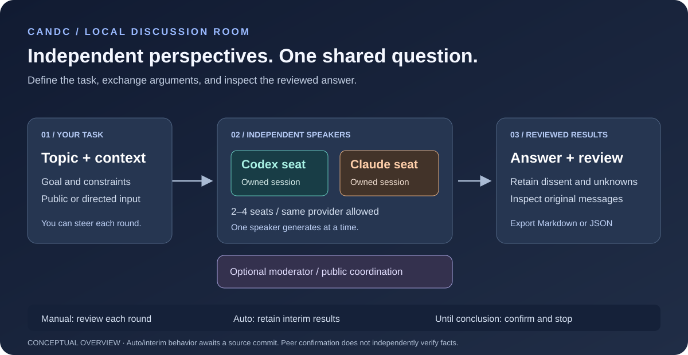

# CandC

**Bring independent AI perspectives into one local discussion room.**

> **Implementation status (2026-10-06):** This revision includes reviewed interim
> results in auto/manual mode, the facilitator's first opening, neutral control fallback
> and related prompt/UI/export changes with regression tests. See the
> [implementation comparison](docs/IMPLEMENTATION_STATUS.md) for changes from `30c2511`
> and the limits of deterministic and live-model validation.

CandC is a local app for Windows, macOS and Linux for discussing a question with **2–4 AI speaker seats**
and an optional independent moderator. Set a topic, compare arguments, add your own
constraints and review the resulting answer in a browser. Codex and Claude run through
owned background CLI processes; each seat has its own session and workspace, including
seats using the same provider. Existing desktop chats are not reused.



*Conceptual overview, not a product screenshot. Speakers take turns; the diagram does
not imply simultaneous speaker generation. Peer review records agreement on the answer,
not independent verification of its facts.*

**Windows / macOS / Linux · Node.js 24 · Local single-user app · Codex + Claude live · MIT handwritten code**

[Install without Git](docs/INSTALLATION.md) · [Source quick start](#quick-start-on-windows) · [How it works](#how-a-discussion-works) ·
[User guide](docs/USER_GUIDE.md) · [Development](CONTRIBUTING.md) · [Security](SECURITY.md)

## What can you do with it?

- **Compare an engineering decision.** Give seats the same goal and constraints, then
  ask them to examine tradeoffs, challenge assumptions and retain unresolved risks.
- **Explore a topic together.** Use joint analysis without assigning opposing positions;
  contribute new information while the discussion develops.
- **Run a structured debate.** Assign each speaker an explicit stance. Speakers may revise
  a position when justified; the app does not require forced disagreement or minimum rounds.
- **Review an answer before accepting it.** Another seat reviews the exact proposal for
  missing requested content. Results retain dissent, limitations and unknowns.
- **Keep the discussion inspectable.** Read original messages, reviewed results and
  diagnostics separately; export saved content as Markdown or JSON.

For example, discuss: “Which approach should we use for a small internal service?”
Supply the expected workload, operating environment and maintenance constraints, then
assign implementation and reliability perspectives to different seats. This is a
suggested use case, not a measured claim about model quality.

## Install without cloning

Install **Node.js 24 and npm** first. No Git or development tools are required.

macOS/Linux:

```sh
curl -fsSL https://github.com/kyos0109/CandC/releases/latest/download/install.sh | sh
```

Windows PowerShell:

```powershell
irm https://github.com/kyos0109/CandC/releases/latest/download/install.ps1 | iex
```

Release assets become available after all three platforms pass the release workflow.

Release installation downloads compiled files, installs locked runtime dependencies,
and starts the app.
PATH is not changed; the installer supplies fixed start/stop entries and exact
commands for `status`, `update` and `doctor`. Updates require a stopped server and
preserve history and agent workspaces. See [installation and deployment](docs/INSTALLATION.md)
for shell/PowerShell commands, custom paths, headless use and failure recovery.

Release verification and publication run in [GitHub Actions](https://github.com/kyos0109/CandC/actions).
Native verification limits are recorded in [Validation](VALIDATION.md).

## Quick start on Windows

You need Node.js **24.x**. Live mode also needs the official CLI and subscription login
for each selected provider. **Demo mode needs no provider login** and uses scripted
replies without live AI or network research.

1. For live Codex/Claude seats, install their official CLIs and sign in in a terminal:

   ```powershell
   codex login
   claude auth login
   ```

   Never paste credentials into CandC. You only need the CLI for the providers you use;
   you do not need to keep a CLI terminal open.
2. From this project directory, run **`Start-CandC.cmd`**. It installs locked dependencies
   if needed, builds the app, starts a hidden backend and opens
   [http://127.0.0.1:4317](http://127.0.0.1:4317).
3. Choose **Demo / 示範** for a first look, or **Live AI / 真實 AI** for real inference.
   Enter the topic, configure the seats and choose an execution mode. Live seats need
   explicitly selected available models and effort settings.
4. Create the discussion. In manual mode, choose **Continue discussion / 繼續討論**
   after each round; use the Conversation, Conclusion and Diagnostics tabs to inspect it.
5. Run **`Stop-CandC.cmd`** to cancel owned turns and stop the backend. Saved history remains.

For a terminal launch:

```powershell
npm ci --ignore-scripts
npm run dev
```

macOS source users can open `Start-CandC.command` / `Stop-CandC.command` in the
project root. Linux source users can run `sh Start-CandC.sh` / `sh Stop-CandC.sh`.
Keep these entrypoints in the project root; they call the shared logic in `scripts/`.
These source launchers build the app; installed release launchers reuse compiled files.

`dev` and the launcher replace normal build outputs. For development verification
that preserves those outputs, use `npm run build:isolated`.

Repeated start opens the running compatible instance; repeated stop reports that it is
already stopped. The launcher does not kill another process occupying the port. An
occupied port without a compatible health response is an error; shutdown succeeds only
once the listener closes. `CANDC_PORT` changes the port; match start and stop.

## How a discussion works

1. **Define the task.** Enter a topic, optional goal and constraints. Configure 2–4
   seats, joint analysis or debate, execution mode, speaking order and limits.
2. **Exchange arguments.** One speaker generates at a time. You can send public input
   or direct a private message to one seat. Public answers remain visible to the room.
3. **Review the proposed answer.** Speakers review the same proposal. Missing requested
   content prompts correction; silence and message delivery do not count as agreement.
4. **Keep the appropriate result.** Execution mode determines whether a reviewed
   participant result is an interim record or a final outcome.

| Execution mode | What happens after a round or reviewed participant result? | Useful when |
| --- | --- | --- |
| **Manual / 手動** | Pauses after one speaker-count round. Reviewed results are interim results; you choose when to continue. | Inspect and steer each round. |
| **Automatic / 自動** | Continues useful discussion within limits. Reviewed interim results do not automatically end the room. | Further analysis with bounded execution. |
| **Until conclusion / 有結論就停** | Stops when all configured speakers confirm the same reviewed proposal. A partial result remains labeled partial. | An explicitly reviewed final answer. |

An optional **facilitator** gives a brief neutral opening before the first speaker,
then coordinates public exchanges. It cannot impose a result. Explicit **judge mode**
permits intervention and labeled unilateral rulings; that authority is separate from
participant agreement and can finish a room in any execution mode.

Disagreement or an honest inability to determine an answer can be a complete response
to the requested question. Missing requested content remains partial. Neither peer
confirmation nor a completed label proves that the underlying facts are true.

## A room you can read and steer

| Area | What you will find |
| --- | --- |
| **Conversation / 對話** | Original messages, seat identity, directed input and execution controls. Long replies fold without truncating saved content. |
| **Conclusion / 結論** | Proposals under review, reviewed interim results, final outcomes, dissent, gaps, topic history and exports. |
| **Diagnostics / 診斷** | Call and delivery details, rejected optional claims, blocking control errors and performance observations. |
| **Settings / 設定** | Idle configuration changes, execution limits, moderator authority and task settings. |
| **Reading settings / Aa** | Light/dark themes, 14/16/18px text, comfortable/compact density, full/highlight reading and interface language. |

Traditional Chinese is the default interface. Open **Aa → Language / 語言 → English**
to switch; the browser remembers the choice. Drafts, recipients and reading settings
are preserved. User text, model answers and evidence keep their original language;
switching does not invoke translation or rewrite saved content.

See the [user guide](docs/USER_GUIDE.md) for privacy, result states, pause/stop and recovery.

## Provider support and practical limits

| Provider | Live execution | Demo seats |
| --- | --- | --- |
| Codex | Supported, subject to CLI/login/model readiness | Supported |
| Claude | Supported, subject to CLI/login/model readiness | Supported |
| Gemini | Locked pending CLI authentication and tool-isolation validation | Supported |
| Grok | Locked pending CLI authentication and tool-isolation validation | Supported |

There is no API-key fallback. Live calls use the selected provider's subscription login
and are subject to its limits. `npm run doctor` reports sanitized CLI readiness without
starting a model turn. Demo illustrates application behavior with scripted replies;
it does not establish real model quality or live-provider compatibility.

CandC targets a **trusted local single-user workspace**. Only one discussion can run
at a time across supported behavior versions. New browser discussions use version 3;
version 1/2 histories keep their original behavior. Opening an old history never upgrades
it; explicit upgrade creates a new discussion and preserves the source journal.

## Research, privacy and durable history

Research is **off by default**. Enabling it allows selected speakers to access permitted
public HTTPS content and authorized local text roots through a bounded read-only gateway.
Authorized content may be sent to those providers. The gateway blocks credentials,
escaping paths and private network destinations, and records redacted evidence. Filtering
is not complete data-loss prevention; review roots before enabling access.
The moderator currently has no research tools. See [SECURITY.md](SECURITY.md).

Directed input is visible only to its addressed speaker, including when another seat
uses the same provider. The moderator sees public discussion. A speaker's public reply
to private input is still public; use that boundary when choosing what to send.

History lives in `data/` unless `CANDC_DATA_DIR` is set. CLI authentication stays in
provider-owned locations. If saving is unconfirmed, further writes and AI scheduling
stop. Recovery/rebuilding never automatically retries an unknown-result turn.

| Setting | Purpose |
| --- | --- |
| `CANDC_PORT` | Change the local listener port; match start and stop. |
| `CANDC_DATA_DIR` | Select the history directory. |
| `CANDC_CODEX_HOME` | Select an explicit Codex home. |
| `CANDC_CODEX_PATH`, `CANDC_CLAUDE_PATH` | Select explicit provider executables. |
| `CANDC_PERFORMANCE_ENABLED=0` | Disable disposable performance collection under `.cache/performance/`. |

Performance diagnostics observe user-started turns without additional inference.
Missing measurements remain unknown. Offline journal compaction requires a stopped
server and preserves backups; see the [user guide](docs/USER_GUIDE.md#storage-and-maintenance)
and [performance contract](docs/PERFORMANCE_CONTRACT.md).

## Documentation and development

| Document | Read it for |
| --- | --- |
| [User guide](docs/USER_GUIDE.md) | Room setup, everyday operation, results and recovery. |
| [Implementation status](docs/IMPLEMENTATION_STATUS.md) | Implemented changes from the historical baseline and validation limits. |
| [Room contract](docs/ROOM_CONTRACT.md) | Authoritative version 3 scheduling, privacy, authority and persistence rules. |
| [Interface contract](docs/UI_UX_SPEC.md) | Implemented reading, layout and localization behavior. |
| [Discussion policy evaluation](docs/DISCUSSION_POLICY_EVAL.md) | Policy assertions, regression owners and evidence limits. |
| [Focused contract](docs/FOCUSED_CONTRACT.md) | Legacy version 1/2 behavior. |
| [AGENTS.md](AGENTS.md) / [Contributing](CONTRIBUTING.md) | Code ownership, change boundaries and canonical checks. |
| [Validation](VALIDATION.md) | Dated observed checks and untested limits; not a guarantee about every later working tree. |
| [Security](SECURITY.md) | Trust boundary, research access and reporting. |

The handwritten code is MIT licensed. Generated Codex declarations retain upstream
Apache-2.0 terms; see [THIRD_PARTY_NOTICES.md](THIRD_PARTY_NOTICES.md).

`npm run export:public` creates a scanned source-only directory and hashed manifest
under `.cache/`, including these docs and the SVG overview. It excludes private data,
credentials, dependencies, build outputs and Git history. It does not publish or rewrite
this repository. Review the export before creating a public repository. Cross-platform
CI uses fake providers; secret scans and public export remain Windows release gates.
